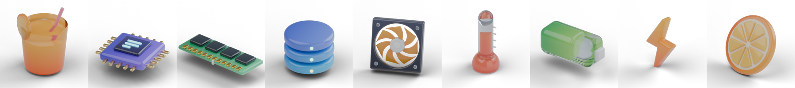
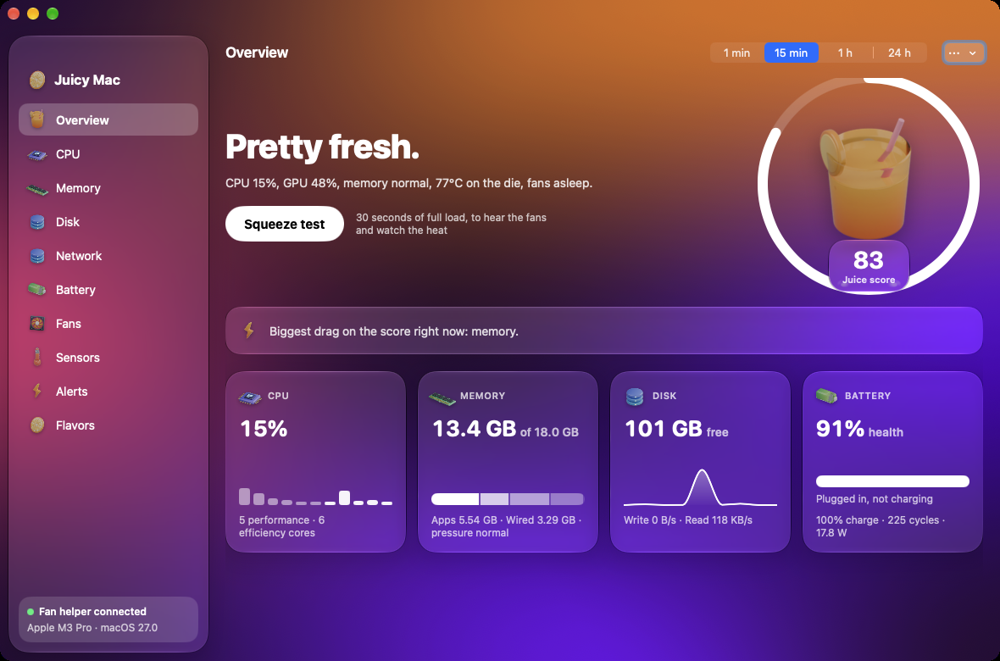
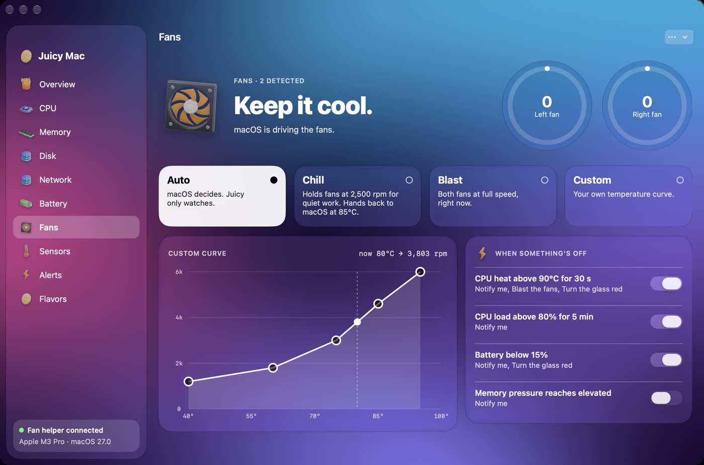
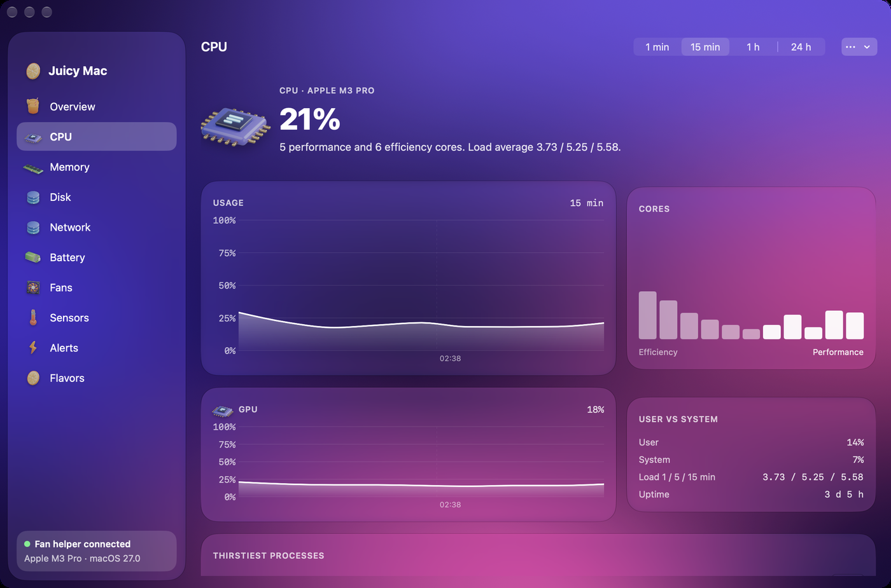

<h1 align="center">Juicy Mac</h1>

<p align="center">A low-level control centre for MacBooks that lives in the menu bar.<br>
Battery, CPU, memory, disk, network, temperatures — and the fans, when you want them louder.</p>

<p align="center">
<a href="https://github.com/vladislavkovalskyi/juicymac/releases/latest"></a>


<a href="LICENSE"></a>
</p>

<p align="center"></p>

<p align="center"></p>

## What it is

Juicy Mac reads what macOS knows about your machine and shows it in one place, with a
Liquid Glass interface and a juice metaphor running through it: the menu bar icon is a glass
that empties as the battery drains, apps that eat CPU are the "thirstiest", and colour themes
are flavours.

Everything on screen comes from the real machine — `host_processor_info`, `host_statistics64`,
IOKit power sources, the SMC — not from estimates.

## Features

**Menu bar**
- Four item styles: Glass, Glass + number, Readouts (three metrics), Pulse (live CPU trace)
- Turns red with the reason when an alert rule fires
- Popover with charge, CPU, memory, disk, heat, fan modes, thirstiest apps and flavours
- ⌥⌘J opens it from anywhere

<p align="center"></p>

**Modules**
- **Overview** — Juice score (0–100) with a plain-language verdict, heads-up when something
  is off, and a **Squeeze test**: 30 seconds of full load that grades the cooling A–D
- **CPU** — per-core bars split into performance and efficiency, GPU utilisation, load average, top processes
- **Memory** — Activity Monitor's breakdown (apps, wired, compressed, cached), pressure, swap
- **Disk** — free space, read and write throughput
- **Network** — download and upload rates from 64-bit interface counters
- **Battery** — health, cycles, capacity in mAh, voltage, current, adapter wattage, temperature
- **Fans** — Auto / Chill / Blast / Custom with a draggable temperature → rpm curve
- **Sensors** — every readable SMC temperature, grouped and searchable (226 on an M3 Pro)
- **Alerts** — rules like "CPU heat above 90 °C for 30 s → blast the fans, notify me, turn the glass red"
- **Flavors** — Orange, Lime, Grape, Cherry, Blueberry, and Ripe, which follows the battery

**Extras**
- Copy a plain-text system report, export history as CSV
- Shortcuts actions: Juice score, Mac temperature, Set fan mode
- Keep the Mac awake, launch at login
- History for 24 hours: raw samples for 15 minutes, minute averages beyond that

<p align="center">


</p>

## Fan control, and why it needs a helper

Reading the SMC works from a normal process. Writing fan speeds does not: it needs root.
Juicy Mac ships a small privileged helper (`SMAppService.daemon`) whose only job is to write
two keys per fan. You approve it once in System Settings → Login Items.

Safety rails:

- The helper accepts XPC connections only from the app, signed by the same team.
- Targets are clamped to the fan's own minimum and maximum.
- Chill hands the fans back to macOS as soon as the CPU passes 85 °C.
- If the app stops sending commands for 30 seconds, or quits, the helper returns the fans to automatic.

Fan control on Apple silicon relies on undocumented SMC keys. Without the helper everything
else still works, read-only.

## Install

Download the DMG from [Releases](https://github.com/vladislavkovalskyi/juicymac/releases/latest),
open it and drag **Juicy Mac** to Applications.

The app is signed with a development certificate, not a paid Developer ID, so Gatekeeper stops the
first launch. Right-click the app → **Open** → **Open**, or clear the quarantine flag once:

```bash
xattr -dr com.apple.quarantine "/Applications/Juicy Mac.app"
```

Fan control asks to install its helper the first time you use it; everything else works without it.

## Build

Requires macOS 26+, Xcode 26+ and [XcodeGen](https://github.com/yonaskolb/XcodeGen).

```bash
brew install xcodegen
scripts/test.sh              # 35 tests: pure logic plus live samplers
scripts/build.sh             # Debug build (Release for a signed build)
scripts/make-dmg.sh 1.0.0    # Release build packed into dist/JuicyMac-1.0.0.dmg
```

The Xcode project is generated from `project.yml`, so re-run `xcodegen generate` (or `scripts/build.sh`)
after adding or removing files.

## Layout

```
App/          SwiftUI app: menu bar item, popover, window, modules, design system
Helper/       Privileged helper (XPC, writes fan keys only)
JuicyKit/     Swift package
  CSMC          C client for the AppleSMC user client
  JuicyCore     Models, history, Juice score, alert engine, fan curve — pure and tested
  JuicySystem   Samplers: CPU, memory, disk, network, battery, GPU, sensors, processes
  JuicyHelperKit XPC protocol and the fan writer
design/icons/ Blender scripts that render the 3D icon set
docs/dev/     Concept and implementation notes
scripts/      build, test and DMG packaging
```

Icons are modelled and rendered from scratch in Blender (`design/icons/render_icons.py`);
no icon packs are used.

## Status

v1, personal project. Built and tested on a MacBook Pro 14" (M3 Pro, macOS 27).
Not yet tested on Intel Macs or on a MacBook Air, where the Fans module has nothing to control.

## Licence

MIT — see [LICENSE](LICENSE).
